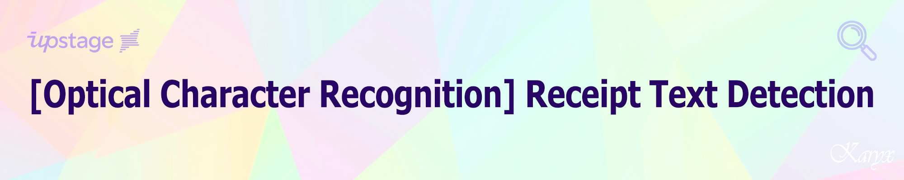
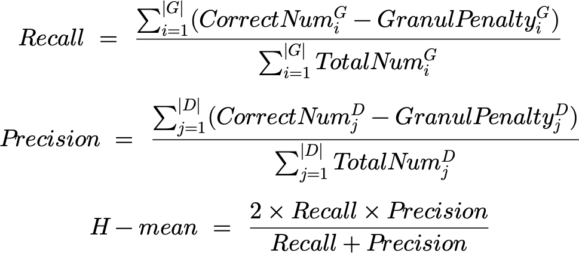
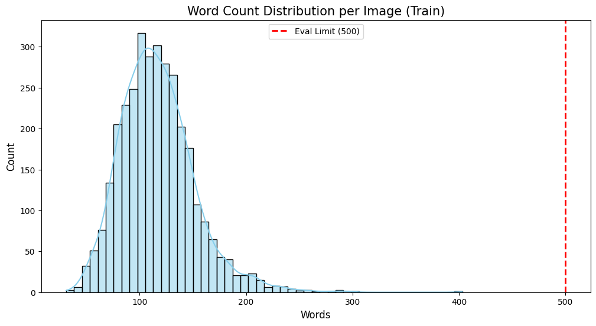
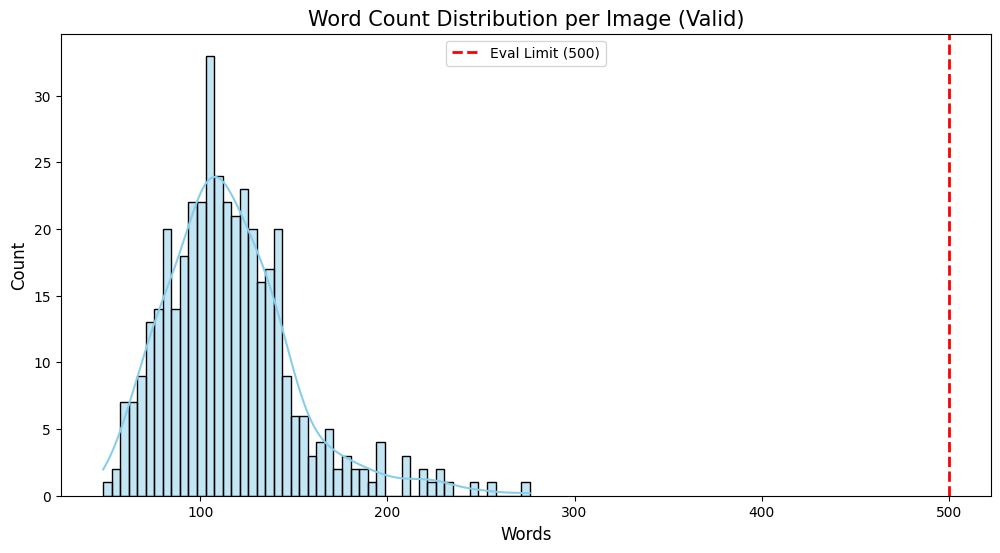
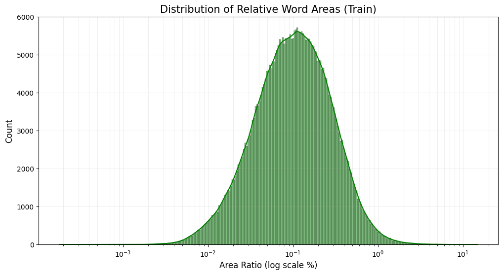
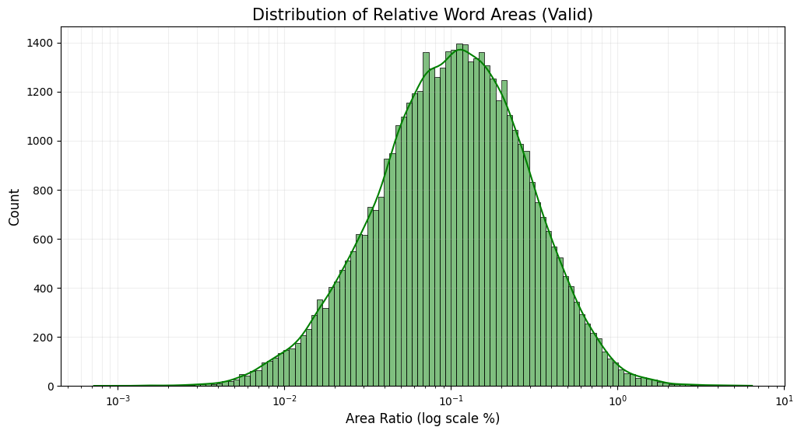
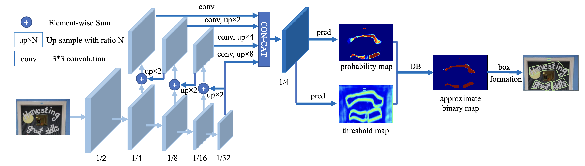
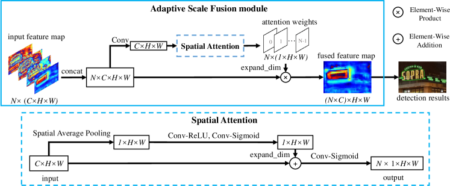
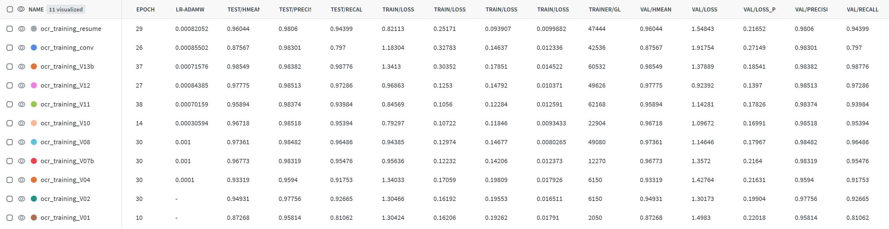

## **💻 Project Overview**
### Environment
- **OS:** Linux Ubuntu 20.04.6 LTS
- **GPU:** NVIDIA GeForce RTX 3090 (24GB)
- **NVIDIA Driver Version:** 535.86.10
- **CUDA Version:** 12.2 (Runtime: 11.8)
- **Tool:** VS Code (SSH) / Google Colab
- **Language:** Python 3.10.13

### Requirements
```
albumentations==1.3.1                             Polygon3==3.0.9.1
autopep8==2.0.4                                   pyclipper==1.3.0.post5
better-exceptions==0.3.3                          PyYAML==6.0.1
easydict==1.11                                    safetensors==0.4.1
editdistance==0.6.2                               setuptools==69.0.3
flake8==6.1.0                                     scikit-image==0.22.0
huggingface-hub==0.19.4                           scikit-learn==1.3.2
hydra-core==1.3.2                                 scipy==1.11.4
imageio==2.33.0                                   seaborn==0.13.0
lightning==2.1.3                                  shapely==2.0.2
pytorch-lightning==2.1.3                          tensorboard==2.15.1
matplotlib==3.8.2                                 tensorboard-data-server==0.7.2
numpy==1.26.2                                     timm==0.9.12
numba==0.58.1                                     torchmetrics==1.2.1
opencv-python==4.8.1.78                           tqdm==4.66.1
pandas==2.1.4                                     wandb==0.16.1
pathlib==1.0.1                                    torch==2.1.2+cu118
Pillow==10.1.0                                    torchvision==0.16.2+cu118
```

---

## **📋 Competition Info**
### 일정 (Timeline)
- 2026.05.04 09:00 ~ 2026.05.14 18:00 (Competition)
- 2026.05.15 15:00 ~ 2026.05.15 17:00 (Seminar)

### 영수증 글자 검출 대회: 영수증 사진에서 글자 위치를 정확하게 추출하는 태스크 수행
- 목표: 모델이 더욱 강건한 성능을 낼 수 있도록 generalization과 optimization을 모두 높이면서도, 그 사이의 최적점 찾기
- 각각의 영수증마다 평균 100여개의 text region이 있으며 polygon 좌표로 labeling 되어 있음
- 한 이미지 당 최대 글자 영역은 500개까지이며, 500개를 초과하는 글자 영역은 평가 대상에서 제외

### 데이터셋 정보 (Dataset Info)
- 학습 데이터: 3,272장
- 검증 데이터: 404장
- 평가 데이터: 413장
- 라벨 정보: 각 text word 별 좌표 정보 (CSV 형식의 결과 데이터를 파일로 제출)

### 규정 (Rule)
- 학습셋과 검증셋은 구분되어 있지만, 다른 기준으로 재분류 하거나 검증셋을 학습에 사용해도 무방
- 저작권 및 사용권에 문제가 없는 공개 데이터셋과 사전학습 가중치에 대해서 자유롭게 사용 가능
- 평가 데이터셋 시각화와 TTA(Test Time Augmentaion), SSL(Self-Supervised Learning) 등은 데이터 분석 및 학습에 활용 가능
- 자동화된 기법이 아닌 인위적인 labeling을 통한 학습은 절대 불가

### 평가지표 (Evaluation Metric)
- CLEval (Character Level Evaluation)
- 리더보드 순위는 H-Mean(Higher is better)으로 순위 결정 (소수점 4번째자리까지)
- Public 과 Private의 비율은 50:50 이며, 이미지 당 평균 단어 수 균등하게 분배



### 유의사항 (Evaluation Guidelines)
- 이번 대회는 Text Detection이 목적이므로 detection 결과에 대해서만 평가
- Ground Truth와 Prediction 모두 transcription 정보는 사용안함
- Ground Truth의 문자 영역에 대한 labeling은 polygon 기준이므로, CLEval 평가도 QUAD가 아닌 POLY방식으로 평가
- polygon의 좌표는 4점 이상을 대상으로 하며, 3점 이하의 영역은 무시되니 주의

---

## **⚙️ Components**
### Directory
```
├── assets/...                              # README images & PDF
├── code/
│   ├── configs/
│   │   ├── preset/
│   │   │   ├── datasets/
│   │   │   │   └── db.yaml                 # Dataset, Transform 등 데이터에 관련된 설정값
│   │   │   ├── lightning_modules/
│   │   │   │   └── base.yaml               # PyTorch Lightning 실행에 관련된 설정값
│   │   │   ├── models/                     # 모델 구성에 필요한 각각의 모듈에 관련된 설정값
│   │   │   │   ├── decoder/
│   │   │   │   │   └── unet.yaml
│   │   │   │   ├── encoder/
│   │   │   │   │   └── timm_backbone.yaml
│   │   │   │   ├── head/
│   │   │   │   │   └── db_head.yaml
│   │   │   │   ├── loss/
│   │   │   │   │   └── db_loss.yaml
│   │   │   │   └── model_example.yaml      # 각 모델 모듈의 설정 파일 및 Optimizer 지정
│   │   │   ├── base.yaml
│   │   │   └── example.yaml                # 각 모듈의 설정 파일 지정
│   │   ├── predict.yaml                    # Runner를 실행할 때 필요한 설정값
│   │   ├── test.yaml                       # Runner를 실행할 때 필요한 설정값
│   │   └── train.yaml                      # Runner를 실행할 때 필요한 설정값
│   ├── ocr/                                # 각 디렉토리마다 __init__.py 존재
│   │   ├── datasets/
│   │   │   ├── base.py
│   │   │   ├── db_collate_fn.py
│   │   │   └── transforms.py
│   │   ├── lightning_modules/
│   │   │   ├── callbacks/
│   │   │   └── ocr_pl.py
│   │   ├── metrics/
│   │   │   ├── box_types.py
│   │   │   ├── cleval_metric.py
│   │   │   ├── data.py
│   │   │   ├── eval_functions.py
│   │   │   └── utils.py
│   │   ├── models/
│   │   │   ├── decoder/
│   │   │   │   ├── asf.py
│   │   │   │   └── unet.py
│   │   │   ├── encoder/
│   │   │   │   └── timm_backbone.py
│   │   │   ├── head/
│   │   │   │   ├── db_head.py
│   │   │   │   └── db_postprocess.py
│   │   │   ├── loss/
│   │   │   │   ├── bce_loss.py
│   │   │   │   ├── db_loss.py
│   │   │   │   ├── dice_loss.py
│   │   │   │   └── l1_loss.py
│   │   │   └── architecture.py
│   │   └── utils/
│   │       ├── convert_submission.py
│   │       └── ocr_utils.py
│   ├── outputs/                            # (이하 GitHub 관리안함)
│   │   ├── ocr_training/
│   │   │   ├── .hydra/...
│   │   │   ├── checkpoints/...
│   │   │   ├── logs/...
│   │   │   └── submissions/...
│   │   └── submission.csv
│   ├── runners/
│   │   ├── predict.py
│   │   ├── test.py
│   │   └── train.py
│   ├── wandb/...                           # (이하 GitHub 관리안함)
│   ├── baseline.ipynb                      # (GitHub 관리안함)
│   └── eda.ipynb                           # EDA
├── data/                                   # (이하 GitHub 관리안함)
│   └── datasets/
│       ├── images/
│       │   ├── test/...
│       │   ├── train/...
│       │   └── val/...
│       ├── jsons/
│       │   ├── test.json
│       │   ├── train.json
│       │   └── val.json
│       └── sample_submission.csv
├── .gitignore
├── README.md
└── requirements.txt
```

---

## **💾 Data Description**
### EDA (Exploratory Data Analysis)
#### 1. 학습 JSON 구조
```
images:
  └─ drp.en_ko.in_house.selectstar_nnnnnn.jpg
    └─ words
      └─ nnnn: 이미지마다 검출된 words의 index 번호 (0으로 채운 4자리 정수값)
        └─ points
          └─ List 4개: X Position, Y Position (검출한 text region의 이미지상 좌표)
```
#### 2. 평가 feature 구성
> 헤더행: filename,polygons<br>
> 데이터행: IMAGE_FILENAME,X Y X Y X Y X Y|X Y X Y X Y X Y|...

#### 3. Qualitative Glimpse
> 영수증은 이미지 크기도 작고 글자도 작고 많다. 이에 맞는 알고리즘과 백본 모델 검색할 것<br>
> 대회 안내와 다르게 학습데이터 3,273장이 아닌 3,272장

#### 4. Images & JSON Inspection
> 이미지 폴더 내의 이미지 건수와 JSON 목록 건수 및 파일명 일치 여부 확인: 정상<br>
> 500 박스 이상 평가 불가 위험군 검출: 이상치 없음

#### 5. 이미지 건당 박스(word) 개수 분포
> 주로 100건 안팎, 200건 이상은 많지 않음



#### 6. 이미지 건당 word들의 크기 분포
> min: 0.0으로 유효하지 않은 박스가 많음을 확인하여 필터링<br>
> 필터링 후에도 $10^{-1}$ (0.1%) 영역에 박스가 몰려있다. 작은 글자가 많으므로 이미지 크기 확장 필요<br>
> $10^{0}$ (1%): 제목급 글자<br>
> $10^{-1}$ (0.1%): 가장 많은 분포. 일반적인 본문 텍스트 수준<br>
> $10^{-2}$ (0.01%): 주석이나 작은 캡션



### Data Preprocessing

---

## **🧠 Modeling**
### Model Architecture
#### 1. DBNet
DBHead를 통해 확률 맵(Probability Map)과 임계값 맵(Threshold Map)을 예측하고 이를 결합해 근사 이진화 맵(Approximate Binary Map)을 생성



#### 2. DBNet++
기존 DBNet의 구조에 ASF(Adaptive Scale Fusion) 모듈을 도입하여, 다양한 크기와 비율을 가진 텍스트에 대해 공간적 어텐션(Spatial Attention)을 적용함으로써 탐지 성능 극대화



### Model Description
#### 1. ResNet-18
- 가장 범용적으로 사용되는 백본으로, Skip Connection을 통해 깊은 층에서도 기울기 소실 문제 없이 학습 가능
- 연산이 진행될수록 해상도가 낮아지는 downsampling 구조라 이 과정에서 작은 글자의 공간 정보가 손실될 위험
- 고해상도 특징 맵을 복원하기 위해 별도의 FPN(Feature Pyramid Network) 등이 필수적으로 요구됨
- 가볍고 빨라서 실시간 처리가 필요한 OCR 서비스나 모바일 환경에 적합

#### 2. ResNet-50
- ResNet-18과 특징은 동일하나 층이 더 깊고 BottleNeck 구조를 사용하여 복잡한 텍스트 패턴을 더 잘 학습함

#### 3. HRNet-W48
- 이미지의 해상도를 낮췄다가 다시 높이는 기존 방식과 달리, 학습 내내 고해상도를 유지하는 구조
- 다양한 해상도의 분기를 병렬로 연결하여 정보를 계속 교환
- 정교한 위치 탐색: 텍스트 영역의 경계선이나 아주 작은 글자를 검출할 때 공간 정보 손실이 적어 정확도가 매우 높음
- 다양한 스케일 대응: 병렬 구조 덕분에 이미지 내 큰 글자와 작은 글자가 섞여 있어도 특징을 효과적으로 잡아냄

---

## **🕵️‍♀️ Hypothesis Testing**
#### 1. 배경 제거

---

## **💡 Insights from Trial and Error**
#### V05: 실험 실패
- **증상:** V04 실험까지 수행한 후 기본 아키텍처를 DBNet++로 변경하는 과정에서 recall이 0이 되는 현상
- **원인:** 원인 파악이 불가하여 베이스라인부터 코드 변경 사항을 추적해보니 V04 실험에선 문제없었던 유효 학습률이 임계값 아래로 너무 빨리 떨어져서 가중치 업데이트가 사실상 vanishing 상태였던 것으로 추정
- **조치:** 학습률을 0.001로 원복하고 AdamW를 차후 SGD로 변경 고려
- **교훈:** 알고리즘이나 모델 변경 같은 큰 변경사항을 먼저 수행하지 않으면 자잘한 실험은 모두 시간낭비가 된다.

#### V08: HRNet-W48 변경
- **증상:** batch_size를 계속 낮춰도 GPU OOM 발생
- **조치:** batch_size를 2까지 낮춤

---

## **📊 Experiment Logger**
<table>
  <thead>
    <tr>
      <th align="center">NO.</th>
      <th align="center">DATE</th>
      <th align="center">MODEL</th>
      <th align="center" colspan="3">H-Mean | Precision | Recall (CV)</th>
      <th align="center" colspan="3">H-Mean | Precision | Recall (LB)</th>
    </tr>
  </thead>
  <tbody>
    <tr>
      <td align="center">08</td>
      <td align="center">260507</td>
      <td>DBNetPlus_HRNet-W48</td>
      <td align="center">0.9736</td>
      <td align="center">0.9848</td>
      <td align="center">0.9648</td>
      <td align="center"><b>0.9725</b></td>
      <td align="center"><b>0.9872</b></td>
      <td align="center"><b>0.9610</b></td>
    </tr>
    <tr>
      <td align="center">07</td>
      <td align="center">260506</td>
      <td>DBNetPlus_ResNet-18</td>
      <td align="center">0.9649</td>
      <td align="center">0.9806</td>
      <td align="center">0.9536</td>
      <td align="center"><b>0.9785</b></td>
      <td align="center"><b>0.9867</b></td>
      <td align="center"><b>0.9717</b></td>
    </tr>
    <tr>
      <td align="center">04</td>
      <td align="center">260505</td>
      <td>DBNet_ResNet-50</td>
      <td align="center">0.9331</td>
      <td align="center">0.9593</td>
      <td align="center">0.9175</td>
      <td align="center"><b>0.9564</b></td>
      <td align="center"><b>0.9686</b></td>
      <td align="center"><b>0.9509</b></td>
    </tr>
    <tr>
      <td align="center">03</td>
      <td align="center">260505</td>
      <td>DBNet_ResNet-18</td>
      <td align="center">0.9012</td>
      <td align="center">0.9765</td>
      <td align="center">0.8433</td>
      <td align="center"><b>0.9466</b></td>
      <td align="center"><b>0.9772</b></td>
      <td align="center"><b>0.9227</b></td>
    </tr>
    <tr>
      <td align="center">02</td>
      <td align="center">260504</td>
      <td>DBNet_ResNet-18</td>
      <td align="center">0.9493</td>
      <td align="center">0.9775</td>
      <td align="center">0.9266</td>
      <td align="center"><b>0.9489</b></td>
      <td align="center"><b>0.9832</b></td>
      <td align="center"><b>0.9206</b></td>
    </tr>
    <tr>
      <td align="center">01</td>
      <td align="center">260504</td>
      <td>DBNet_ResNet-18</td>
      <td align="center">0.8726</td>
      <td align="center">0.9581</td>
      <td align="center">0.8106</td>
      <td align="center"><b>0.8818</b></td>
      <td align="center"><b>0.9651</b></td>
      <td align="center"><b>0.8194</b></td>
    </tr>
  </tbody>
</table>
<br>


<br>

---

## **🚀 Result**
### Champion Model Info
- **Version:** V07 (DBNet++ / ResNet-18)
- **Training Time:** 3h 6m
- **Time per Epoch:** 6m 12s
- **Selected CKPT:** Epoch 25
- **Accuracy:** 0.9785

---

## **📜 Version Log**
> **V01: epoch=8-step=1845.ckpt**
- image size 640 기본 유지
- dataset_base_path 변경, train wandb 사용

> **V02: epoch=29-step=6150.ckpt**
- use_polygon: True, max_epochs: 30
- GPU 활용 최적화를 위한 hyperparameter tuning

> **V03: epoch=22-step=4715.ckpt**
- optimizer: AdamW, weight_decay: 0.01

> **V04: epoch=21-step=4510.ckpt**
- image size 1024 변경
- weight_decay: 0.0001 (rollback), lr: 0.0001
- in_channels: [256, 512, 1024, 2048]
- val/hmean 기준 checkpoint 생성

> **V07: epoch=25-step=10634.ckpt**
- 아키텍처 변경 과정의 이슈로 V05-V06 실험 폐기, 일단 ResNet-18로 복원
- lr: 0.001 (rollback)
- DBNet++ 적용, image size 1280

> **V08: epoch=18-step=31084.ckpt**
- 백본 모델 변경으로 학습 시간 길어지기 시작하여 tmux 적용
- 로컬 점수는 최고점 갱신했으나 LB 갱신못함

---

## **🛠️ etc.**
### Reference
- [[arXiv] Real-time Scene Text Detection with Differentiable Binarization](https://arxiv.org/pdf/1911.08947.pdf)
- [[GitHub] DBNet](https://github.com/MhLiao/DB)
- [[arXiv] Real-Time Scene Text Detection with Differentiable Binarization and Adaptive Scale Fusion](https://arxiv.org/pdf/2202.10304.pdf)
- [[Docs] Hydra](https://hydra.cc/docs/intro/)
- [[Docs] PyTorch Lightning](https://lightning.ai/docs/pytorch/stable/)
- [[arXiv] Character-Level Evaluation for Text Detection and Recognition Tasks](https://arxiv.org/abs/2006.06244)
- [[GitHub] CLEval](https://github.com/clovaai/CLEval)

### Project Retrospective

<br>
