## **💻 Project Overview**
### Environment
- **OS:** Linux Ubuntu 20.04.6 LTS
- **System Memory**: 256GB RAM
- **Computing Power**: 24-Core / 48-Thread Multi-core CPU
- **GPU:** NVIDIA GeForce RTX 3090 (24GB)
- **NVIDIA Driver Version:** 535.86.10
- **CUDA Version:** 12.2 (Runtime: 11.8)
- **Tool:** VS Code (SSH) / Google Colab
- **Language:** Python 3.10.13

### Requirements
```
albumentations==1.3.1                             Polygon3==3.0.9.1
autopep8==2.0.4                                   pyclipper==1.3.0.post5
better-exceptions==0.3.3                          PyYAML==6.0.1
easydict==1.11                                    safetensors==0.4.1
editdistance==0.6.2                               setuptools==69.0.3
flake8==6.1.0                                     scikit-image==0.22.0
huggingface-hub==0.19.4                           scikit-learn==1.3.2
hydra-core==1.3.2                                 scipy==1.11.4
imageio==2.33.0                                   seaborn==0.13.0
lightning==2.1.3                                  shapely==2.0.2
pytorch-lightning==2.1.3                          tensorboard==2.15.1
matplotlib==3.8.2                                 tensorboard-data-server==0.7.2
numpy==1.26.2                                     timm==0.9.12
numba==0.58.1                                     torchmetrics==1.2.1
opencv-python==4.8.1.78                           tqdm==4.66.1
pandas==2.1.4                                     wandb==0.16.1
pathlib==1.0.1                                    torch==2.1.2+cu118
Pillow==10.1.0                                    torchvision==0.16.2+cu118
```

---

## **📋 Competition Info**
### 일정 (Timeline)
- 2026.05.04 09:00 ~ 2026.05.14 18:00 (Competition)
- 2026.05.15 15:00 ~ 2026.05.15 18:00 (Seminar)

### 영수증 글자 검출 대회: 영수증 사진에서 글자 위치를 정확하게 추출하는 태스크 수행
- 목표: 모델이 더욱 강건한 성능을 낼 수 있도록 generalization과 optimization을 모두 높이면서도, 그 사이의 최적점 찾기
- 각각의 영수증마다 평균 100여개의 text region이 있으며 polygon 좌표로 labeling 되어 있음
- 한 이미지 당 최대 글자 영역은 500개까지이며, 500개를 초과하는 글자 영역은 평가 대상에서 제외

### 데이터셋 정보 (Dataset Info)
- 학습 데이터: 3,272장
- 검증 데이터: 404장
- 평가 데이터: 413장
- 라벨 정보: 각 text word 별 좌표 정보 (CSV 형식의 결과 데이터를 파일로 제출)

### 규정 (Rule)
- 학습셋과 검증셋은 구분되어 있지만, 다른 기준으로 재분류 하거나 검증셋을 학습에 사용해도 무방
- 저작권 및 사용권에 문제가 없는 공개 데이터셋과 사전학습 가중치에 대해서 자유롭게 사용 가능
- 평가 데이터셋 시각화와 TTA(Test Time Augmentaion), SSL(Self-Supervised Learning) 등은 데이터 분석 및 학습에 활용 가능
- 자동화된 기법이 아닌 인위적인 labeling을 통한 학습은 절대 불가

### 평가지표 (Evaluation Metric)
- CLEval (Character Level Evaluation)
- 리더보드 순위는 H-Mean(Higher is better)으로 순위 결정 (소수점 4번째자리까지)
- Public 과 Private의 비율은 50:50 이며, 이미지 당 평균 단어 수 균등하게 분배


### 유의사항 (Evaluation Guidelines)
- 이번 대회는 Text Detection이 목적이므로 detection 결과에 대해서만 평가
- Ground Truth와 Prediction 모두 transcription 정보는 사용안함
- Ground Truth의 문자 영역에 대한 labeling은 polygon 기준이므로, CLEval 평가도 QUAD가 아닌 POLY방식으로 평가
- polygon의 좌표는 4점 이상을 대상으로 하며, 3점 이하의 영역은 무시되니 주의

---

## **⚙️ Components**
### Workflow
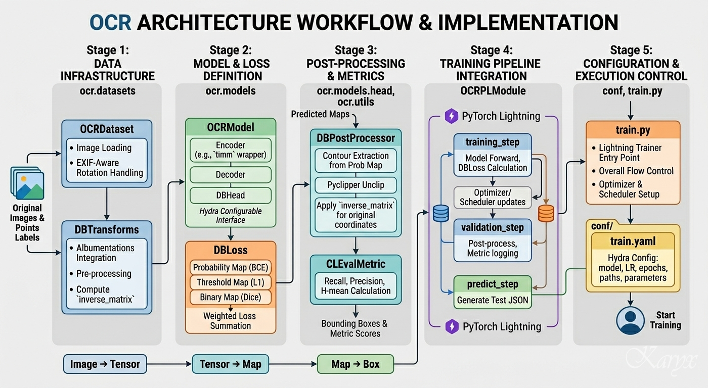

### Directory
```
├── assets/...                              # README images & PDF
├── code/
│   ├── configs/
│   │   ├── preset/
│   │   │   ├── datasets/
│   │   │   │   └── db.yaml                 # Dataset, Transform 등 데이터에 관련된 설정값
│   │   │   ├── lightning_modules/
│   │   │   │   └── base.yaml               # PyTorch Lightning 실행에 관련된 설정값
│   │   │   ├── models/                     # 모델 구성에 필요한 각각의 모듈에 관련된 설정값
│   │   │   │   ├── decoder/
│   │   │   │   │   └── unet.yaml
│   │   │   │   ├── encoder/
│   │   │   │   │   └── timm_backbone.yaml
│   │   │   │   ├── head/
│   │   │   │   │   └── db_head.yaml
│   │   │   │   ├── loss/
│   │   │   │   │   └── db_loss.yaml
│   │   │   │   └── model_example.yaml      # 각 모델 모듈의 설정 파일 및 Optimizer 지정
│   │   │   ├── base.yaml                   # Hydra 경로 관리 메인 설정
│   │   │   └── example.yaml                # 각 모듈의 설정 파일 지정
│   │   ├── predict.yaml                    # Runner를 실행할 때 필요한 설정값
│   │   ├── test.yaml                       # Runner를 실행할 때 필요한 설정값
│   │   └── train.yaml                      # Runner를 실행할 때 필요한 설정값
│   ├── ocr/                                # 각 디렉토리마다 __init__.py 존재 생략
│   │   ├── datasets/
│   │   │   ├── base.py                     # 데이터 로딩 및 전처리를 위한 기본 추상 클래스
│   │   │   ├── db_collate_fn.py            # 학습 배치를 위한 데이터 정렬 및 패딩 처리 로직
│   │   │   └── transforms.py               # 이미지 증강 및 텐서 변환 정의
│   │   ├── lightning_modules/
│   │   │   ├── callbacks/                  # 학습 중 특정 시점에 실행되는 보조 로직
│   │   │   └── ocr_pl.py                   # PyTorch Lightning 기반 학습/검증 루프 통합 관리
│   │   ├── metrics/
│   │   │   ├── box_types.py                # 좌표 타입 정의 및 유효성 검사
│   │   │   ├── cleval_metric.py            # OCR 대회 표준 평가 지표 계산 로직
│   │   │   ├── data.py                     # 평가에 필요한 데이터 구조화 및 핸들링
│   │   │   ├── eval_functions.py           # GT와 예측값 비교를 위한 세부 평가 함수
│   │   │   └── utils.py                    # 지표 계산 속도 향상 및 보조 유틸리티
│   │   ├── models/
│   │   │   ├── decoder/
│   │   │   │   ├── asf.py                  # Adaptive Scale Fusion
│   │   │   │   └── unet.py                 # 검출 성능 향상을 위한 U-Net 기반 디코더 구조
│   │   │   ├── encoder/
│   │   │   │   └── timm_backbone.py        # timm 라이브러리를 활용한 다양한 사전학습 백본 지원
│   │   │   ├── head/
│   │   │   │   ├── db_head.py              # Differentiable Binarization 방식의 최종 검출 헤드
│   │   │   │   └── db_postprocess.py       # 확률 맵을 실제 박스 좌표로 변환하는 후처리 로직
│   │   │   ├── loss/                       # 다양한 손실 함수들
│   │   │   │   ├── bce_loss.py
│   │   │   │   ├── db_loss.py              # DBNet 학습을 위한 전용 복합 손실 함수
│   │   │   │   ├── dice_loss.py
│   │   │   │   └── l1_loss.py
│   │   │   └── architecture.py             # encoder-decoder-head를 조립하는 전체 모델 설계도
│   │   └── utils/
│   │       ├── convert_submission.py       # 최종 제출 CSV 변환 유틸리티
│   │       └── ocr_utils.py                # 모델 예측 결과 시각화 유틸리티
│   ├── outputs/                            # (이하 GitHub 관리안함)
│   │   ├── ocr_training/
│   │   │   ├── .hydra/...                  # 실험 최종 설정값 및 오버라이드 스냅샷
│   │   │   ├── checkpoints/...             # 학습된 모델 가중치(.ckpt) 저장
│   │   │   ├── logs/...                    # 학습 과정 모니터링 로그
│   │   │   └── submissions/...             # 추론 JSON (CSV 변환 전)
│   │   ├── prob_maps/                      # 모델별 예측 확률값(.npy) 저장
│   │   │   ├── convnext/...
│   │   │   ├── convnext_tta/...
│   │   │   ├── hrnet/...
│   │   │   └── hrnet_tta/...
│   │   └── submission.csv                  # 추론 후 제출할 파일 생성
│   ├── postprocessing/...                  # 시각화 & 후처리 테스트 코드 (GitHub 관리안함)
│   ├── runners/
│   │   ├── predict.py                      # 추론 실행파일
│   │   ├── test.py                         # 검증 실행파일
│   │   ├── train.py                        # 학습 실행파일
│   │   ├── save_prob_maps.py               # 단일 모델 실행 후 확률 맵을 npy로 추출
│   │   ├── save_prob_maps_tta.py           # 추론 TTA (앙상블 포함)
│   │   └── ensemble_prob_maps.py           # 최종 앙상블 결과 도출
│   ├── wandb/...                           # W&B log (GitHub 관리안함)
│   ├── baseline.ipynb                      # baseline guide (GitHub 관리안함)
│   └── eda.ipynb                           # EDA Notebook
├── data/                                   # (이하 GitHub 관리안함)
│   └── datasets/
│       ├── images/
│       │   ├── test/...                    # 평가데이터
│       │   ├── train/...                   # 학습데이터
│       │   └── val/...                     # 검증데이터
│       ├── jsons/
│       │   ├── test.json                   # 평가좌표 (이미지 사이즈만 존재)
│       │   ├── train.json                  # 학습좌표
│       │   └── val.json                    # 검증좌표
│       └── sample_submission.csv           # 제출파일 template
├── .gitignore
├── README.md
└── requirements.txt
```

---

## **💾 Data Description**
### EDA (Exploratory Data Analysis)
#### 1. 학습 JSON 구조
```
images:
  └─ drp.en_ko.in_house.selectstar_nnnnnn.jpg
    └─ words
      └─ nnnn: 이미지마다 검출된 words의 index 번호 (0으로 채운 4자리 정수값)
        └─ points
          └─ List 4개: X Position, Y Position (검출한 text region의 이미지상 좌표)
```
#### 2. 평가 feature 구성
> 헤더행: filename,polygons<br>
> 데이터행: IMAGE_FILENAME,X Y X Y X Y X Y|X Y X Y X Y X Y|...

#### 3. Qualitative Glimpse
> 영수증은 이미지 크기도 작고 글자도 작고 많다. 이에 맞는 알고리즘과 백본 모델 검색할 것<br>
> 영수증 자체는 세로로 긴 형태가 대부분이나 배경까지 함께 찍혀 정사각형인 경우 다수<br>
> 대회 안내와 다르게 학습 데이터 3,273장이 아닌 3,272장

#### 4. Images & JSON Inspection
> 이미지 폴더 내의 이미지 건수와 JSON 목록 건수 및 파일명 일치 여부 확인: 정상<br>
> 500 박스 이상 평가 불가 위험군 검출: 이상치 없음

#### 5. 이미지 건당 박스(word) 개수 분포
> 주로 100건 안팎, 200건 이상은 많지 않음


#### 6. 이미지 건당 word들의 크기 분포
> min: 0.0으로 유효하지 않은 박스가 많음을 확인하여 필터링<br>
> 필터링 후에도 $10^{-1}$ (0.1%) 영역에 박스가 몰려있다. 작은 글자가 많으므로 이미지 크기 확장 필요<br>
> $10^{0}$ (1%): 제목급 글자<br>
> $10^{-1}$ (0.1%): 가장 많은 분포. 일반적인 본문 텍스트 수준<br>
> $10^{-2}$ (0.01%): 주석이나 작은 캡션


#### 7. 학습 & 검증 GT 박스 해당 범위 (bounding box)
> 바코드는 범위 해당없음 (바코드 숫자는 해당)<br>
> 뒷면 글자 비침, 타 영수증 이염, 로고, 낙서, 개인정보 마스킹 등은 불규칙하게 범위 해당<br>
> 영수증과 무관한 바깥 배경에 존재하는 글자도 GT에 포함되는 케이스 존재

#### 8. 평가 영수증 시각화 (V08 실험 결과로 중간 점검)
> 구겨진 영수증 heatmap: 100% 검출<br>
> 글자 수 많고 밝기 어둡고 불규칙한 영수증 bounding box: 100% 검출
<p align="center">
  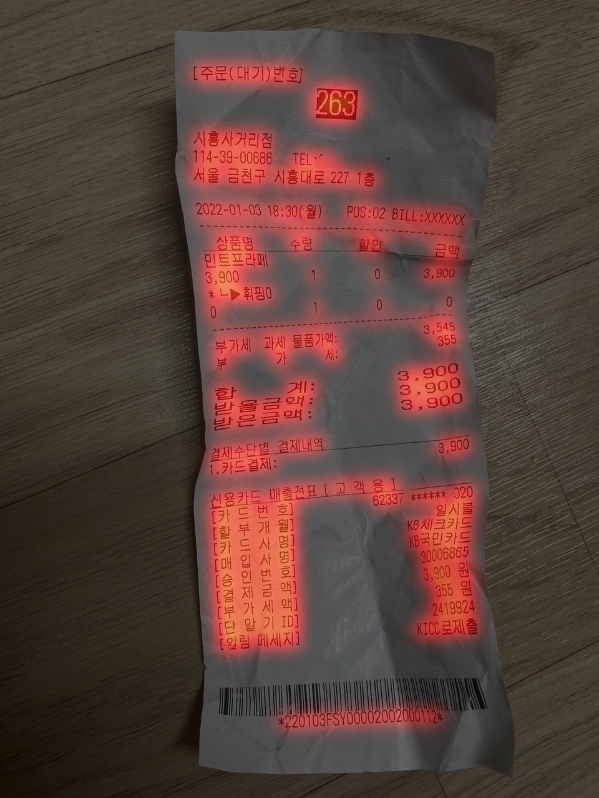
  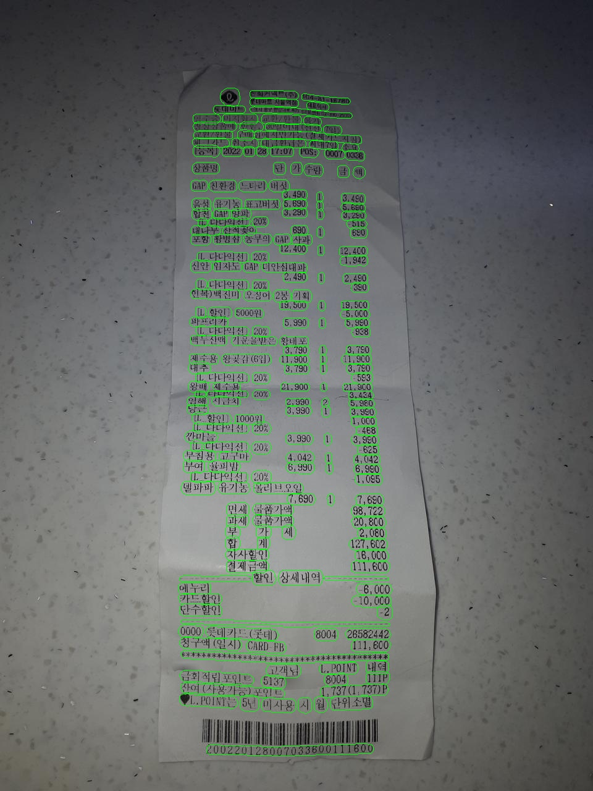
</p>

#### 9. polygon 형태 비교 (V08 실험 결과로 중간 점검)
> 학습/검증 데이터: 선은 직선에 가깝고 모서리는 사각형에 가깝다.<br>
> 평가 데이터: 선이 자글자글하고 모서리가 둥글다.

#### 10. 검증 GT 시각화 비교 (최종 추론 모델 사용)
> 검증 GT는 json 생성이 되지 않으므로 ocr_utils.py를 활용, 신규 코드 작성<br>
> HRNet, ConvNeXt 추론 모델 모두 GT의 랜덤 뒷면 글자 비침이나 노이즈 등에 대한 거대 박스를 못 잡고 있다. (GT: red)<br>
> 역설적으로 GT에 사용된 모델보다 내 모델이 더 좋은거 같은데? 🤔
<p align="center">
  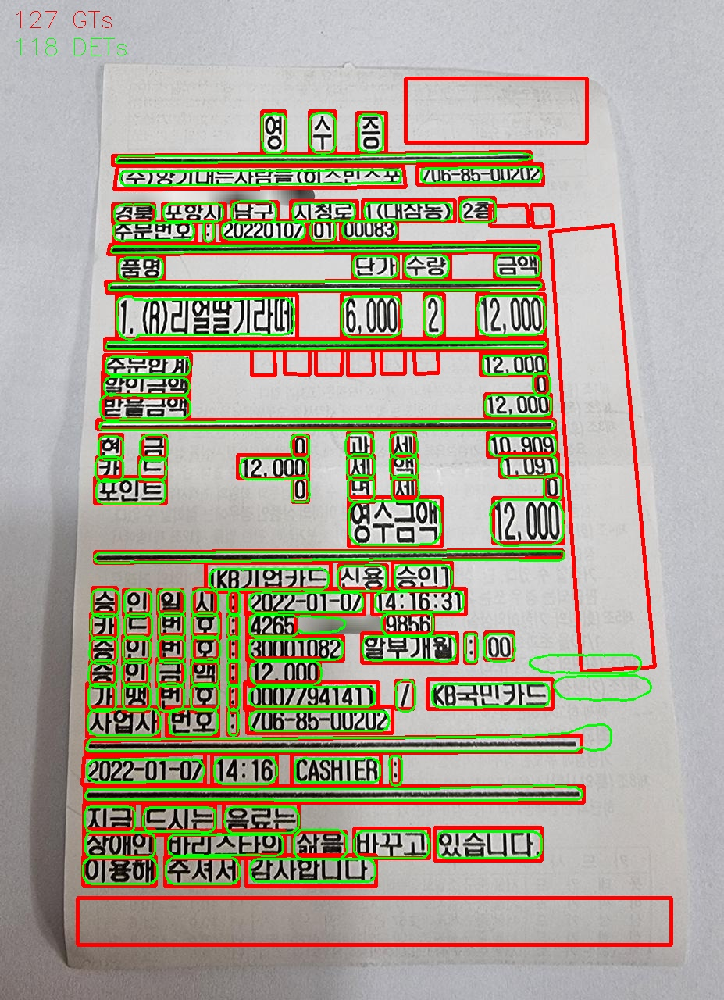
  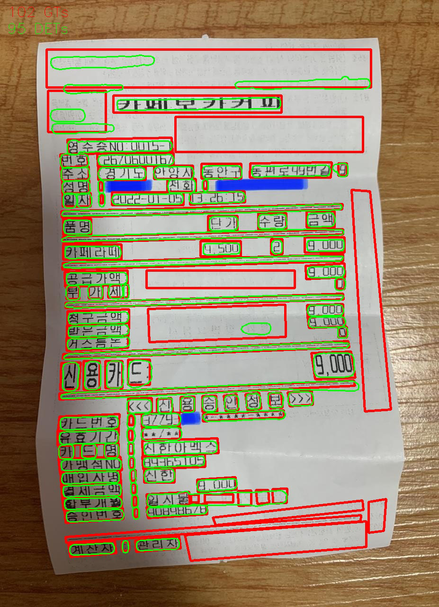
</p>

---

## **🧠 Modeling**
### Model Architecture
#### 1. DBNet
DBHead를 통해 확률 맵(Probability Map)과 임계값 맵(Threshold Map)을 예측하고 이를 결합해 근사 이진화 맵(Approximate Binary Map)을 생성


#### 2. DBNet++
기존 DBNet의 구조에 ASF(Adaptive Scale Fusion) 모듈을 도입하여, 다양한 크기와 비율을 가진 텍스트에 대해 공간적 어텐션(Spatial Attention)을 적용함으로써 탐지 성능 극대화


### Model Description
#### 1. ResNet-18
- 가장 범용적으로 사용되는 백본으로, Skip Connection을 통해 깊은 층에서도 기울기 소실 문제 없이 학습 가능
- 연산이 진행될수록 해상도가 낮아지는 downsampling 구조라 이 과정에서 작은 글자의 공간 정보가 손실될 위험
- 고해상도 특징 맵을 복원하기 위해 별도의 FPN(Feature Pyramid Network) 등이 필수적으로 요구됨
- 가볍고 빨라서 실시간 처리가 필요한 OCR 서비스나 모바일 환경에 적합

#### 2. ResNet-50
- ResNet-18과 특징은 동일하나 층이 더 깊고 BottleNeck 구조를 사용하여 복잡한 텍스트 패턴을 더 잘 학습함

#### 3. HRNet (W44/W48)
- 이미지의 해상도를 낮췄다가 다시 높이는 기존 방식과 달리, 학습 내내 고해상도를 유지하는 구조
- 다양한 해상도의 분기를 병렬로 연결하여 정보를 계속 교환
- 정교한 위치 탐색: 텍스트 영역의 경계선이나 아주 작은 글자를 검출할 때 공간 정보 손실이 적어 정확도가 매우 높음
- 다양한 스케일 대응: 병렬 구조 덕분에 이미지 내 큰 글자와 작은 글자가 섞여 있어도 특징을 효과적으로 잡아냄

#### 4. ConvNeXt-Base
- Base 모델 특유의 넓은 채널 수를 바탕으로, 복잡한 배경(영수증의 로고, 자연광 반사 등)과 실제 텍스트를 명확히 구분하는 고차원 특징 효과적으로 추출
- 거대 커널(7x7)을 통한 문맥 파악: 일반적인 CNN보다 큰 커널 사이즈를 사용하여 수용 영역(Receptive Field)을 넓혔으며, 이는 가로로 긴 문장이나 끊겨 있는 텍스트 박스를 하나의 객체로 인식하고 연결하는 검출 성능 향상
- 글로벌 정보 유지: ViT(Vision Transformer)의 설계를 차용한 레이어 구조 덕분에 이미지 전체의 공간적 맥락 잘 유지. 이는 텍스트가 이미지 가장자리에 치우쳐 있거나 매우 작은 크기로 산재해 있는 상황에서도 놓치지 않고 박스를 칠 수 있게 함

#### 5. HRnet vs ConvNeXt ensemble
- HRNet은 고해상도 병렬 유지, ConvNeXt는 계층적 downsampling이라 서로 다른 방식으로 특징 추출
- prob_maps averaging (두 모델의 확률맵 평균 후 postprocess): 단순 box NMS보다 경계 품질 좋음

### Modeling Process
```
python runners/train.py preset=example  # train
python runners/test.py preset=example "checkpoint_path='{checkpoint_path}'"  # validation
python runners/predict.py preset=example "checkpoint_path='{checkpoint_path}/epoch=##-step=####.ckpt'"  # inference
python ocr/utils/convert_submission.py --json_path outputs/ocr_training/submissions/YYYYMMDD_HHmmss.json --output_path outputs/submission.csv  # 제출파일 생성

python runners/save_prob_maps.py preset=example "checkpoint_path='{checkpoint_path}/epoch=##-step=####.ckpt'" "+prob_maps_dir='outputs/prob_maps/hrnet'"  # HRNet
python runners/save_prob_maps.py preset=example_convnext "checkpoint_path='{checkpoint_path}/epoch=##-step=####.ckpt'" "+prob_maps_dir='outputs/prob_maps/convnext'"  # ConvNeXt
```

---

## **🕵️‍♀️ Hypothesis Testing**
#### 1.유효하지 않은 박스에 대한 전처리 여부
- **가설:** EDA에서 min: 0.0으로 표시된 아주 작은 박스에 대해 전처리가 필요할까?
- **결과:** 코드상에서 2단계 필터링됨 (학습시 점 3개 미만 skip, 추론시 sside < 3이면 필터링)

#### 2. 절취선 등 기호의 박스 포함 여부
- **가설:** 글자가 아닌 기호나 선 등은 박스에서 제외해야 하지 않을까?<br>
  최종 추론 json에서 일단 지나치게 길고 가는 선만 제거하는 후처리 로직을 적용해보았다.
- **결과:** LB H-Mean 떡락. 영수증에 인쇄된 내용은 바코드 세로줄 빼고 모두 추가되어야 한다.
<p align="center">
  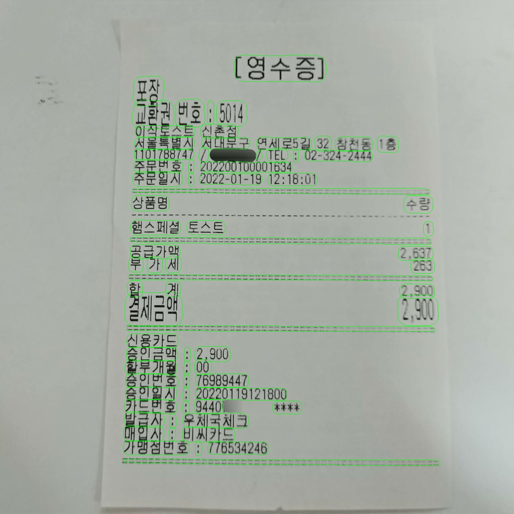
  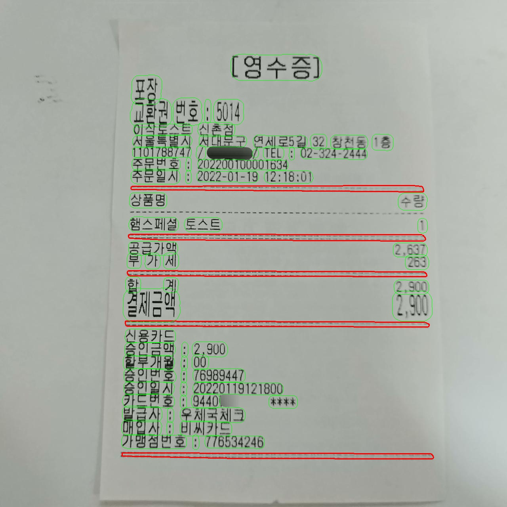
</p>

#### 3. GT의 패턴 학습 위한 augmentation 강화
- **가설:** 파일명, bounding box 등을 근거로, 동일 라벨링 업체가 동일 방법으로 자동화 검출한 뒤 학습/검증/평가 데이터로 랜덤 분류한 것으로 추정. 그러면 인간의 기준으로 학습/검증 데이터의 박스 오류(뒷면 글씨, 낙서, 개인정보 마스킹 일관성 없음, 배경 글자 등)는 평가 GT에도 동일하게 적용될 것이다.
- **결과:** 모델이 GT 라벨 노이즈 패턴의 경향성까지 학습하도록 비침, 이염 등 반영하기 위해 augmentation 하려면 다른 영수증 이미지를 overlay 해야 한다. 테스트케이스 생성 시간 부족으로 TTA로 대체, 실패

#### 4. 영수증 이외 배경 포함 여부
- **가설:** 평가 데이터에서 배경을 모두 쳐내고 영수증만 남기면 어떨까?
- **결과:** 학습 데이터 정답에 배경에 있는 글자도 박스 친 케이스 확인. 인간이 라벨링하지 않은 듯하니 배경도 포함되어야 한다.

#### 5. 추론 후처리
- **가설:** 장시간 학습한 V11, V12 포함 Recall이 모두 현저히 낮다. 원인을 찾으면 강건한 모델이 되지 않을까?
- **결과:** thresh 후처리로 기존 checkpoint 이용, 추론을 재반영하자 Recall 끌어올리며 LB 퀀텀점프

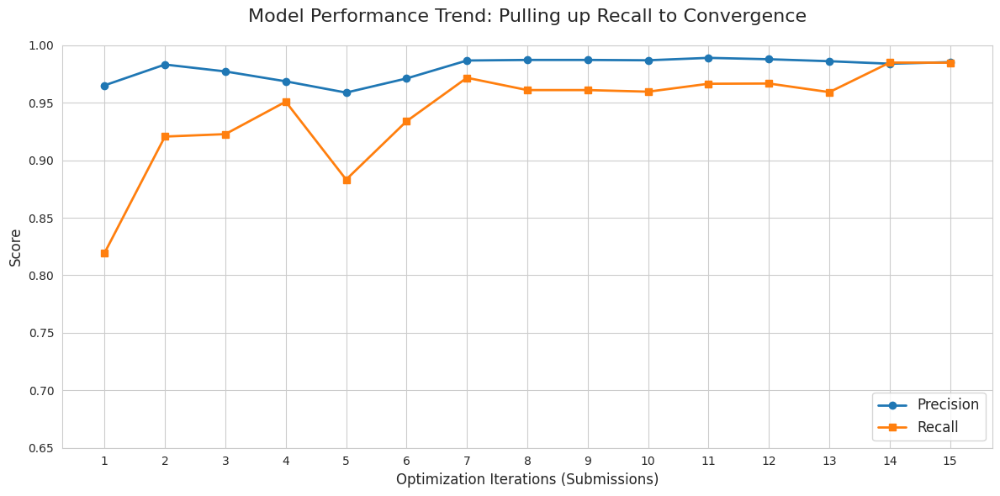

#### 6. polygon 형태 일치 시도
- **가설:** 학습 데이터의 polygon은 직선에 가깝고 평가 데이터의 polygon이 좌표가 훨씬 많다. 선을 평평하게 펴보면 어떨까?
- **결과:** CLEval은 박스 모양 자체는 보지 않으므로 polygon_unclip_ratio 1.31 → 1.4로 후처리했으나 LB H-Mean 하락

#### 7. HRnet vs ConvNeXt ensemble
- **가설:** 학습 데이터 정답에 낙서나 개인정보 마스킹 덜 된 쪼가리도 박스 친 케이스 확인. 그럼 HRNet보다 더 정교하게 박스치고 CNN인 ConvNeXt와 앙상블을 시도해보면 어떨까?
- **결과:** Recall이 높은 ConvNeXt를 weighted average ensemble하여 LB H-Mean 최고점 갱신 (Recall에서 마의 0.99대 뚫음)

#### 8. test.json의 이미지 사이즈 활용 여부
- **가설:** 빈 test.json에 이미지 사이즈만 기재되어 있는데 (이미지의 실제 사이즈와 동일 확인) 모두 제각각이다. 이걸 활용할 방법이 있을까?<br>
  현재는 확장한 이미지를 inverse_matrix로 원본 좌표 복원할 때 이미지를 직접 열어서 사이즈를 얻고 있다. 이미지 사이즈를 미리 알면 패딩 방향과 양을 사전에 계산 가능하고 이미지별 맞춤 후처리도 가능하다.
- **결과:** 먼저 추론 결과에 이미지 경계 밖 좌표가 나오는 케이스는 확인, 그러나 train과 val GT의 clipping 분포 비율도 유사. 따라서 GT의 노이즈 일관성 룰에 근거하여 이미지 사이즈는 활용 불가
```
========================================
📊 train GT 최종 검사 리포트
- 검사 대상 파일 수: 3272개
- 음수 좌표 발견: 24건
- 이미지 크기 초과 발견: 848건
========================================
📊 val GT 최종 검사 리포트
- 검사 대상 파일 수: 404개
- 음수 좌표 발견: 3건
- 이미지 크기 초과 발견: 94건
========================================
📊 test pred (V13) 최종 검사 리포트
- 검사 대상 파일 수: 413개
- 음수 좌표 발견: 1건
- 이미지 크기 초과 발견: 101건
========================================
train: 음수 24건 / 초과 848건 (약 26%)
val  : 음수  3건 / 초과  94건 (약 23%)
test : 음수  1건 / 초과 101건 (약 24%)
```

---

## **💡 Insights from Trial and Error**
#### V05: 실험 실패
- **증상:** V04 실험까지 수행한 후 기본 아키텍처를 DBNet++로 변경하는 과정에서 recall이 0이 되는 현상<br>
  원인 파악이 불가하여 베이스라인부터 코드 변경 사항을 추적해보니 V04 실험에선 문제없었던 유효 학습률이 임계값 아래로 너무 빨리 떨어져서 가중치 업데이트가 사실상 vanishing 상태였던 것으로 추정<br>
- **조치:** 학습률을 0.001로 원복하고 AdamW를 차후 SGD로 변경 고려. 알고리즘이나 모델 변경 같은 큰 변경사항을 먼저 수행하지 않으면 자잘한 실험은 모두 시간낭비가 된다.

#### V08: 백본 모델 HRNet-W48로 변경
- **증상:** batch_size를 계속 낮춰도 GPU OOM 발생
- **조치:** batch_size를 2까지 낮춤

#### V10: scheduler 누락되어 기본 학습률 적용
- **증상:** scheduler와 학습률을 반영했는데도 최종 best epoch 3건이 동일함, 10시간 낭비
- **조치:** architecture 오류 수정 반영, W&B 그래프를 보면 기존에도 스케줄러가 반영 없었던 것으로 추정

#### V11: best epoch 갱신 정체 후 지속적인 갱신
- **증상:** 7차 이상 epoch 갱신이 정체되어 실험을 중단하려는 때에 갑작스런 뒷심 갱신?
- **결과:** scheduler 이슈로 CosineAnnealingLR이 제대로 작동하지 못했었기 때문에 patience를 10회로 늘린 보람이 있나 싶었는데..ㅠ 삼진아웃은 국룰인가.

#### V12: 잦은 loss spike
- **증상:** batch가 2로 너무 작아 gradient가 불안정하고 loss spike가 잦다.
- **결과:** 백본 모델 HRNet-W44로로 낮춰도 batch 2 이상은 OOM
<p align="center">
  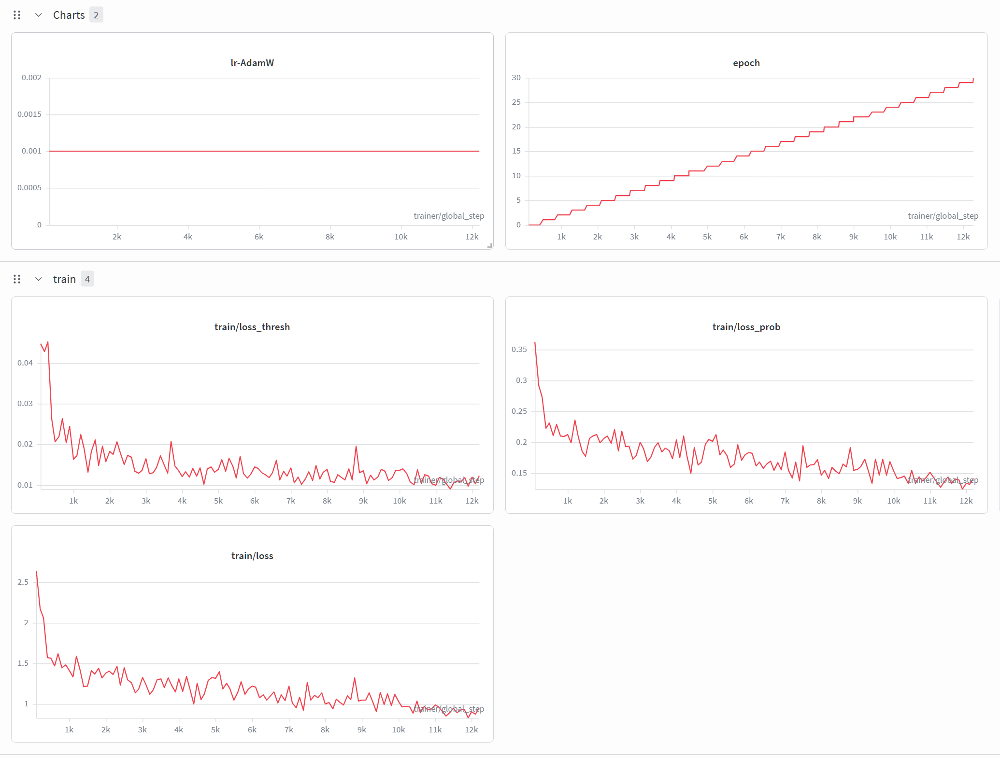
  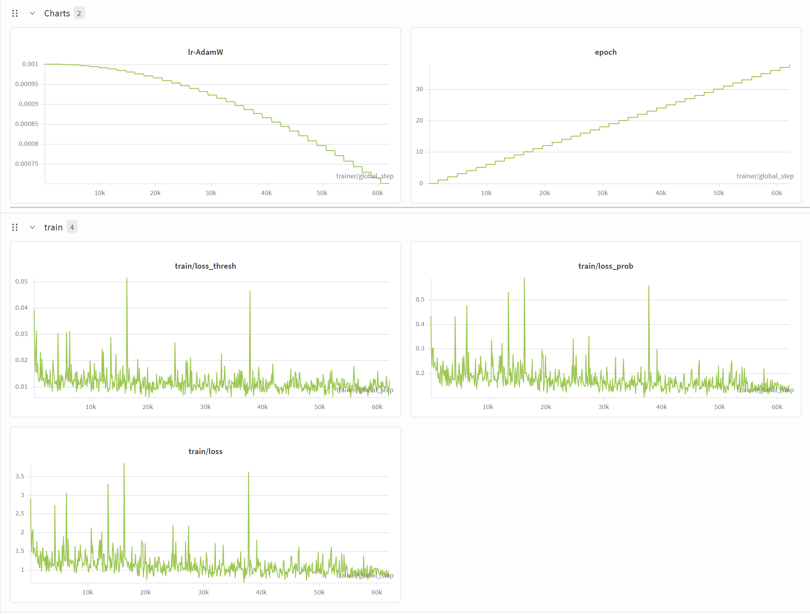
</p>

#### V12: 데이터 증강, TTA
- **시도:** 검증데이터를 학습에 추가, TTA (hflip)
- **결과:** train_dataloader에서 검증데이터 누수로 인한 checkpoint 선택 오염으로 V11보다도 낮은 LB H-Mean

#### V13: box_thresh 후처리
- **시도:** Precision을 향상시키기 위해 box_thresh 증가
- **결과:** Precision은 0.0004 향상되었으나 Precision은 Recall과 trade-off 관계이므로 Recall이 0.001 하락, 최종 H-Mean 하락

#### V14: 백본 모델 ConvNeXt-Base로 변경
- **증상:** ConvNeXt-Small 실행시키고 잠들었다가 6시간 후에 깨보니 H-Mean 0.0242 상태..😭
- **조치:** Base로 모델 scale-up 후 첫 epoch 확인하니 0.98대로 정상화

#### V14.5: HRNet-W44 vs ConvNeXt-Base ensemble
- **시도:** 앙상블 시도하기 전에 실수로 ConvNeXt의 best epoch를 삭제해버림..😨 무려 14h 33m 돌린건데!<br>
  추론 JSON으로 NMS 앙상블이라도 시도해봄
- **결과:** LB H-Mean 0.9780으로 큰 하락

#### V15: ConvNeXt-Base resume
- **시도:** 삭제 후 남아있던 top3의 마지막인 epoch 11부터 resume. top-3 epoch 15, 18, 21 생성
- **결과:** 놀리는 제출 횟수가 아까워서 top-3 checkpoint 모두 시도해봤는데 의미없다..<br>
  ConvNeXt-Base 단독으로는 무리 (H-Mean 0.9868이 최고점)

#### V17: postprocessing hyperparameter tuning
- **시도:** Recall이 0.9902를 기록한 V16.3(H-Mean 0.9894)의 경우 Precision이 0.9889로 많이 낮아 V13 후처리와 유사한 시도 재도전
- **결과:** thresh 0.12, box_thresh 0.42, polygon_unclip_ratio 1.35 모두 실패하며 파라미터 튜닝은 한계에 도달함 확인

#### V20: TTA: brightness/contrast, multi-scale
- **시도:** 최종 추론 모델을 사용하여 검증 GT를 시각화하여 비교하고, missing rate를 통계낸 결과 전체 평균 4.2%<br>
  private shakeup 우려되나 최종 모델인 관계로 재학습 시간은 부족, 더 많은 GT 영역을 잡아낼 TTA 시도
- **결과:** brightness/contrast, multi-scale (1280+1600) 모두 실패

---

## **📊 Experiment Logger**
> **H: H-Mean, P: Precision, R: Recall**<br>
> 실험기록이 많으므로 주요 변화 건만 기재
<table>
  <thead>
    <tr>
      <th align="center">NO.</th>
      <th align="center">DATE</th>
      <th align="center">MODEL</th>
      <th align="center" colspan="3">H | P | R (CV)</th>
      <th align="center" colspan="3">H | P | R (LB)</th>
    </tr>
  </thead>
  <tbody>
    <tr>
      <td align="center">22</td>
      <td align="center">260514</td>
      <td>ensemble+TTA</td>
      <td align="center"></td>
      <td align="center"></td>
      <td align="center"></td>
      <td align="center"><b>0.9897</b></td>
      <td align="center"><b>0.9897</b></td>
      <td align="center"><b>0.9898</b></td>
    </tr>
    <tr>
      <td align="center">18</td>
      <td align="center">260513</td>
      <td>ensemble+TTA</td>
      <td align="center"></td>
      <td align="center"></td>
      <td align="center"></td>
      <td align="center"><b>0.9896</b></td>
      <td align="center"><b>0.9894</b></td>
      <td align="center"><b>0.9899</b></td>
    </tr>
    <tr>
      <td align="center">16</td>
      <td align="center">260513</td>
      <td>ensemble</td>
      <td align="center"></td>
      <td align="center"></td>
      <td align="center"></td>
      <td align="center"><b>0.9894</b></td>
      <td align="center"><b>0.9889</b></td>
      <td align="center"><b>0.9902</b></td>
    </tr>
    <tr>
      <td align="center">14</td>
      <td align="center">260512</td>
      <td>DBNet++_ConvNeXt</td>
      <td align="center">0.9863</td>
      <td align="center">0.9857</td>
      <td align="center">0.9875</td>
      <td align="center"><b>0.9875</b></td>
      <td align="center"><b>0.9881</b></td>
      <td align="center"><b>0.9873</b></td>
    </tr>
    <tr>
      <td align="center">13</td>
      <td align="center">260510</td>
      <td>DBNet++_HRNet-W44</td>
      <td align="center">0.9854</td>
      <td align="center">0.9838</td>
      <td align="center">0.9877</td>
      <td align="center"><b>0.9891</b></td>
      <td align="center"><b>0.9893</b></td>
      <td align="center"><b>0.9891</b></td>
    </tr>
    <tr>
      <td align="center">12</td>
      <td align="center">260509</td>
      <td>DBNet++_HRNet-W44</td>
      <td align="center"></td>
      <td align="center"></td>
      <td align="center"></td>
      <td align="center"><b>0.9710</b></td>
      <td align="center"><b>0.9861</b></td>
      <td align="center"><b>0.9592</b></td>
    </tr>
    <tr>
      <td align="center">11</td>
      <td align="center">260508</td>
      <td>DBNet++_HRNet-W48</td>
      <td align="center">0.9770</td>
      <td align="center">0.9846</td>
      <td align="center">0.9711</td>
      <td align="center"><b>0.9768</b></td>
      <td align="center"><b>0.9890</b></td>
      <td align="center"><b>0.9665</b></td>
    </tr>
    <tr>
      <td align="center">10</td>
      <td align="center">260508</td>
      <td>DBNet++_HRNet-W48</td>
      <td align="center">0.9671</td>
      <td align="center">0.9851</td>
      <td align="center">0.9539</td>
      <td align="center"><b>0.9714</b></td>
      <td align="center"><b>0.9869</b></td>
      <td align="center"><b>0.9596</b></td>
    </tr>
    <tr>
      <td align="center">08</td>
      <td align="center">260507</td>
      <td>DBNet++_HRNet-W48</td>
      <td align="center">0.9736</td>
      <td align="center">0.9848</td>
      <td align="center">0.9648</td>
      <td align="center"><b>0.9725</b></td>
      <td align="center"><b>0.9872</b></td>
      <td align="center"><b>0.9610</b></td>
    </tr>
    <tr>
      <td align="center">07</td>
      <td align="center">260506</td>
      <td>DBNet++_ResNet-18</td>
      <td align="center">0.9677</td>
      <td align="center">0.9831</td>
      <td align="center">0.9547</td>
      <td align="center"><b>0.9785</b></td>
      <td align="center"><b>0.9867</b></td>
      <td align="center"><b>0.9717</b></td>
    </tr>
    <tr>
      <td align="center">04</td>
      <td align="center">260505</td>
      <td>DBNet_ResNet-50</td>
      <td align="center">0.9331</td>
      <td align="center">0.9593</td>
      <td align="center">0.9175</td>
      <td align="center"><b>0.9564</b></td>
      <td align="center"><b>0.9686</b></td>
      <td align="center"><b>0.9509</b></td>
    </tr>
    <tr>
      <td align="center">02</td>
      <td align="center">260504</td>
      <td>DBNet_ResNet-18</td>
      <td align="center">0.9493</td>
      <td align="center">0.9775</td>
      <td align="center">0.9266</td>
      <td align="center"><b>0.9489</b></td>
      <td align="center"><b>0.9832</b></td>
      <td align="center"><b>0.9206</b></td>
    </tr>
    <tr>
      <td align="center">01</td>
      <td align="center">260504</td>
      <td>DBNet_ResNet-18</td>
      <td align="center">0.8726</td>
      <td align="center">0.9581</td>
      <td align="center">0.8106</td>
      <td align="center"><b>0.8818</b></td>
      <td align="center"><b>0.9651</b></td>
      <td align="center"><b>0.8194</b></td>
    </tr>
  </tbody>
</table>
<br>


<br>

---

## **🚀 Result**
### Champion Model Info
- **Version:** V22 (ensemble+TTA), V13 (DBNet++ / HRNet-W44)
- **Training Time:** 12h 53m
- **Time per Epoch:** 20m 53s
- **Selected CKPT:** Epoch 28
- **Accuracy:** 0.9897, 0.9891

### Leaderboard Rank: No. 1 🏆 (Solo Entry)
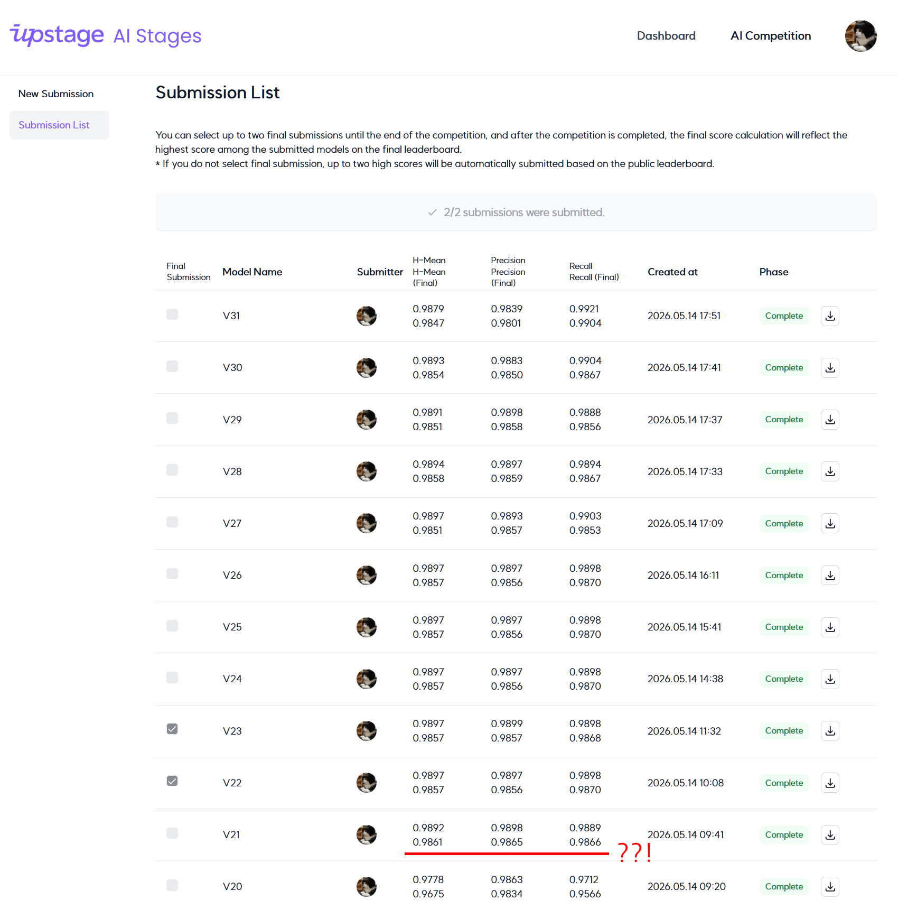
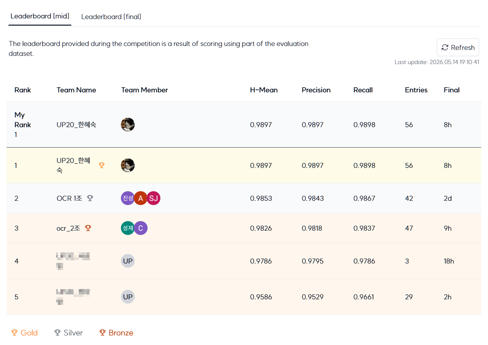
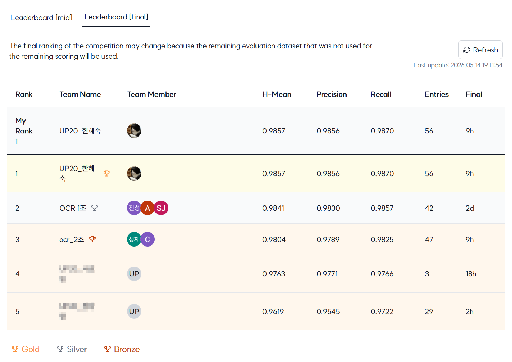

### Presentation
- [[PDF] OCR Seminar Presentation](https://github.com/karmakaryx/ocr-receipt-text-detection/blob/main/assets/semiar_ocr.pdf)

---

## **📜 Version Log**
#### V01: epoch=8-step=1845.ckpt
- image size 640 기본 유지
- dataset_base_path 변경, train wandb 사용

#### V02: epoch=29-step=6150.ckpt
- use_polygon: True, max_epochs: 30
- GPU 활용 최적화를 위한 hyperparameter tuning

#### V04: epoch=21-step=4510.ckpt
- image size 1024 변경
- optimizer: AdamW, lr: 0.0001
- in_channels: [256, 512, 1024, 2048]
- val/hmean 기준 checkpoint 생성

#### V07: epoch=25-step=10634.ckpt
- 아키텍처 변경 과정의 이슈로 V05-V06 실험 폐기, 일단 ResNet-18로 복원
- lr: 0.001 (rollback)
- DBNet++ 적용, image size 1280

#### V08: epoch=18-step=31084.ckpt
- 백본 모델 변경으로 학습 시간 길어지기 시작하여 tmux 적용
- 로컬 점수는 최고점 갱신했으나 LB 갱신못함

#### V10: epoch=11-step=19632.ckpt
- scheduler: CosineAnnealingLR
- early stopping 적용

#### V11: epoch=36-step=60532.ckpt
- sanity check 비활성화
- T_max는 max_epochs와 동일하게
- batch_size loss logging 수치 정확하게
- patience 10으로 증가

#### V12: epoch=25-step=47788.ckpt
- 학습 + 검증 데이터 합치기, TTA (hflip)
- predict postprocessing

#### V13: epoch=28-step=47444.ckpt
- 검증 데이터 누수로 인한 V11 rollback
- augmentation 추가: bright & contrast
- unclip_ratio 파라미터화
- hyperparameter 조정

#### V14: epoch=15-step=26176.ckpt
- 앙상블을 위해 ConvNeXt-Small 추가 실행
- ConvNeXt-Small이 polygon을 거의 못 뽑아 ConvNeXt-Base로 파라미터 변경
- HRNet-W44 vs ConvNeXt-Base NMS ensemble
- epoch 15 삭제 실수로 epoch 11에서 resume 학습

#### V16: epoch=21-step=35992.ckpt
- prob_maps averaging ensemble
- postprocessing hyperparameter tuning

#### V18: ensemble + TTA
- ensemble + TTA (hflip) 재시도 후 LB H-Mean 최고점 갱신
- HRNet-W44 단독 TTA은 ensemble보다 효과 낮음

#### V22: TTA > ensemble
- 기존 ensemble 비율에서 TTA 이후 시도하지 않았던 비율 테스트

---

## **🛠️ etc.**
### Reference
- [[arXiv] Real-time Scene Text Detection with Differentiable Binarization](https://arxiv.org/pdf/1911.08947.pdf)
- [[GitHub] DBNet](https://github.com/MhLiao/DB)
- [[arXiv] Real-Time Scene Text Detection with Differentiable Binarization and Adaptive Scale Fusion](https://arxiv.org/pdf/2202.10304.pdf)
- [[Docs] Hydra](https://hydra.cc/docs/intro/)
- [[Docs] PyTorch Lightning](https://lightning.ai/docs/pytorch/stable/)
- [[arXiv] Character-Level Evaluation for Text Detection and Recognition Tasks](https://arxiv.org/abs/2006.06244)
- [[GitHub] CLEval](https://github.com/clovaai/CLEval)

### Project Retrospective
기존 대회들에선 리더보드 점수 올리기에만 매몰되어 실험기록을 W&B에만 주로 맡기는 바람에 산출물 작성시에 (정신도 몽롱한 상태에서) 애로사항이 많았습니다.<br>
따라서 이번 대회는 LB 점수 지상주의 습관을 지양하고 과정을 더 중요시하기 위해 실험을 서두르지 않았습니다. 순간적인 아이디어가 떠오른다고 일단 코드부터 우당탕탕 고치려는 손가락을 뿌리치며 가설을 정리하고 꼼꼼히 코드 변경사항들을 기록하고 점수 변화의 요인 추적에 더 집중했습니다. (이를 위해 직접 개발한 실험 관리 도구인 KattPaw를 활용, 버전별로 코드 변경 사항만 따로 확인해서 내용을 정리했고 실험 실패시 복원도 쉬워서 뿌듯했습니다. 다만 이번 대회처럼 복잡한 디렉토리 구조에서는 한계점을 느끼며 앱 수정 아이디어도 많이 얻었습니다.)<br>
같은 CV 계열인 문서 분류 대회의 우승 경험이 큰 도움이 되었습니다. 이미 체크포인트로 숱한 삽질했던 고인물이라 기존 대회 중 가장 복잡한 구조였음에도 쉽게 적응이 가능했고 그 때 좋은 결과를 얻었던 실험들과 사용 모델들을 참고하여 새로운 기법들을 추가한 결과, CV 대회 2관왕을 달성할 수 있었습니다! (근데 이번엔 참여자가 몇 명이죠? ...😅)

<br>
